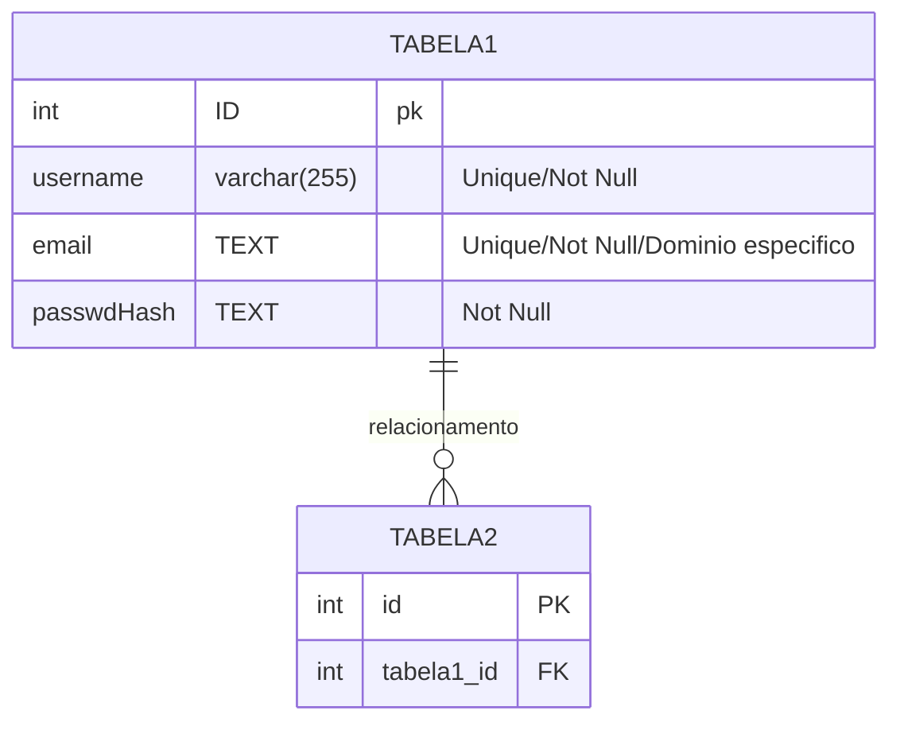
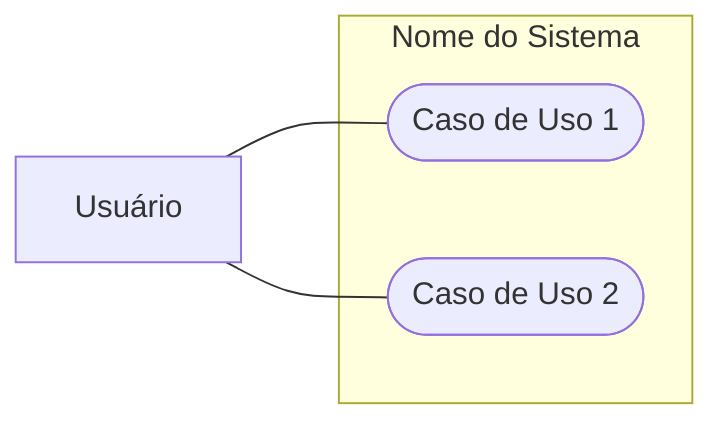
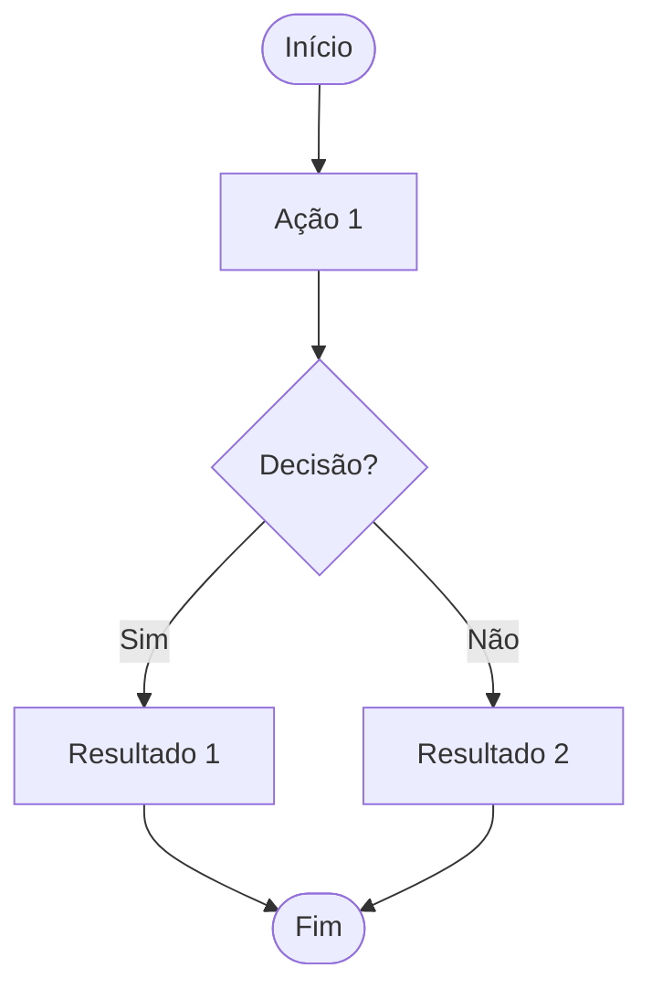

<h1 align="center">Ordo Calamitatis</h1>
<h2 align="center">Sistema de Gerenciamento de Personagens</h2>
<div align="center">


 
 
 
 

</div>
<hr>
Desenvolvida em PHP com banco de dados PostgreSQL, a Ordo Calamitatis é uma aplicação web voltada ao gerenciamento de personagens, itens e rituais — tanto oficiais quanto fan-mades — do RPG **Ordem Paranormal**. 

O sistema visa otimizar a pesquisa sobre essas temáticas e estruturar as criações da comunidade. Para isso, a plataforma implementa operações essenciais de CRUD (Cadastro, Consulta, Atualização e Exclusão), garantindo uma integração robusta e persistente dos dados.

---

## 1. Índice

- [1. Índice](#1-índice)
- [2. Como Executar o Projeto Localmente](#2-como-executar-o-projeto-localmente)
  - [2.1. Pré-Requisitos](#21-pré-requisitos)
  - [2.2. Instalação](#22-instalação)
    - [Passo 1: Clonar o Repositório](#passo-1-clonar-o-repositório)
    - [Passo 2: Configurar o Banco de Dados](#passo-2-configurar-o-banco-de-dados)
    - [Passo 3: Configurar a Conexão no PHP](#passo-3-configurar-a-conexão-no-php)
    - [Passo 4: Acessar a Aplicação localmente](#passo-4-acessar-a-aplicação-localmente)
- [3. Estrutura de Diretórios (INCOMPLETO)](#3-estrutura-de-diretórios-incompleto)
- [4. Especificação de Requisitos](#4-especificação-de-requisitos)
  - [4.1. Requisitos Funcionais](#41-requisitos-funcionais)
  - [4.2. Requisitos Não-Funcionais](#42-requisitos-não-funcionais)
  - [4.3. Regras de Negócio](#43-regras-de-negócio)
- [5. Estrutura do Banco de Dados](#5-estrutura-do-banco-de-dados)
  - [Entidade: `userTabela`](#entidade-usertabela)
  - [Entidade: `[nome_tabela2]`](#entidade-nome_tabela2)
- [6. Diagramas](#6-diagramas)
  - [6.1. Diagrama Entidade-Relacionamento (MER)](#61-diagrama-entidade-relacionamento-mer)
  - [6.2. Diagrama de Casos de Uso](#62-diagrama-de-casos-de-uso)
  - [6.3. Fluxo de \[Processo\]](#63-fluxo-de-processo)
- [7. Protótipos](#7-protótipos)
  - [Baixa Fidelidade:](#baixa-fidelidade)
  - [Alta Fidelidade:](#alta-fidelidade)
- [8. Contribuindo](#8-contribuindo)
- [9. Contato \& Suporte](#9-contato--suporte)

---

## 2. Como Executar o Projeto Localmente
Para rodar este projeto na sua máquina, será necessário ter instalado um ambiente de servidor local (PHP) e o banco de dados PostgreSQL.
### 2.1. Pré-Requisitos
- PHP (v7.4 ou superior) habilitado com a extensão pdo_pgsql.
- PostgreSQL instalado e a rodar na porta 5432.
- Git instalado na máquina.
---

### 2.2. Instalação

#### Passo 1: Clonar o Repositório
Abra o *Git Bash*, e escreva o seguinte: 
```bash
# Copie o reposítório externo no GitHub
git clone https://github.com/Eduardo-Nicolete37/OrdoCalamitatis.git

# Abra o arquivo clonado
cd OrdoCalamitatis
```
---

#### Passo 2: Configurar o Banco de Dados
O projeto deve contar com um arquivo SQL dentro da pasta database, nela está toda as estrutura do Banco de Dados ultilizada pelo Backend. 

Siga os passos descritos abaixo para para recriar o banco no seu PostgreSQL:

1. Abra o Terminal ou o Powershell
2. Conecte-se ao Postgres usando o usuário padrão (postgres)

```bash
psql -U postgres
```
3. Se já existir o banco de dados de algum teste anterior, delete-o e recrie a database, usando os comandos abaixo:
```sql
DROP DATABASE IF EXISTS calamitatisdb; 
CREATE DATABASE calamitatisdb;
```
4. Crie um usuário do Postgres específico para gerenciar este Banco de Dados, ainda com o Postgres aberto, escreva os comandos:
```sql
CREATE USER ordo WITH PASSWORD "*sua_senha*";
ALTER DATABASE calamitatisdb OWNER TO ordo;
\q
```

5. Após transferirmos o Banco de Dados para o usuário *ordo*, abriremos a pasta *database*, e faça o seguinte comando para restaurar as tabelas e registros:
```bash
# Caso você não tenha aberto a pasta, faça:
cd database
# Usamos o arquivo já existente para recuperar as estruturas
psql -U ordo -h localhost -d calamitatisdb -f dumpCalamitatisDB.sql
# Retornamos para a raiz
cd ..
```
---
#### Passo 3: Configurar a Conexão no PHP
Pelo VSCode, abra o arquivo *connect.php* na pasta *database*, editando apenas um campo:
```php
$host = "localhost"; # Não altere esse campo
$dbname = "calamitatisdb"; # Não altere esse campo
$user = "ordo"; # Não altere esse campo
$password = "INSIRA SUA SENHA AQUI"; # Altere apenas esse campo
```
---

#### Passo 4: Acessar a Aplicação localmente
Depois de seguir todos esse passos, você abrirá o terminal e fará os seguintes comandos:
```bash
# No caso de a raiz do projeto não estar aberta, use o comando:
cd OrdoCalamitatis
# Caso você deseje rodar a aplicação localmente, execute o comando:
php -S localhost:8000 
```
Por fim, abra no seu navegador de preferencia, digite o URL *localhost:8000*, e aproveite a aplicação.

---

## 3. Estrutura de Diretórios (INCOMPLETO)
<!--TODO: Comentar os arquivos
✅⬜
-->
```
OrdoCalamitatis
│   .gitignore
│   index.php
│   README.md
├───app
│       char.php
│       charlist.php
│       history.php
│       new_char.php
│       new_item.php
│       new_ritual.php
│       rituals.php
│       weapons.php
├───database
│       connect.php
├───documentation
│       BCD_modelation.md
│       comandosFeitosParaCriacaoDosBancos.pgsql
├───includes
│       footer.php
│       header.php
│       helpers.php
├───login
│       cadastrar.php
│       login.php
│       logout.php
│       verifica_user.php
└───style
        style.css
```

---


## 4. Especificação de Requisitos

### 4.1. Requisitos Funcionais

| ID | Título | Descrição | Prioridade | Feito? |
|----|--------|-----------|------------|---------|
| **RF01** | Autenticação de Usuários | O sistema deve validar credenciais (email/senha) e criar sessão autenticada | Alta |✅|
| **RF02** | Cadastro de Usuários | O sistema deve permitir novo registro com validação de email único | Alta | ✅ |
| **RF03** | Proteção de Rotas | Páginas de usuário devem redirecionar para login se não autenticado | Alta | ✅ |
| **RF04** | Logout Seguro | Destruir sessão e limpar dados de autenticação | Alta | ✅ |
| **RF05** | Criar Criações | O sistema deve fornecer formulários separados para Personagem, Item e Ritual | Alta | ⬜ |
| **RF06** | Listar Criações | O sistema deve exibir todas as criações do usuário | Alta | ⬜ |
| **RF07** | Editar Criações | O sistema deve permitir atualização de qualquer criação do próprio e somente do usuário | Alta | ⬜ |
| **RF08** | Remover Criações | O sistema deve remover criações com confirmação de segurança | Alta | ⬜ |
| **RF09** | Ver Detalhes | O sistema deve exibir informações completas de cada criação | Média | ⬜ |
| **RF10** | Associar Item a Personagem | O sistema deve permitir que personagens possuam itens | Média | ⬜ |
| **RF11** | Associar Ritual a Personagem | O sistema deve permitir que personagens dominem rituais | Média | ⬜ |
| **RF12** | Associar Criação a Temporada | O sistema deve ligar criações a temporadas específicas | Média | ⬜ |


### 4.2. Requisitos Não-Funcionais


| ID | Título | Descrição | Prioridade | Feito? |
|----|--------|-----------|------------|--------|
| **RNF01** | Linguagem | Back-end desenvolvido em PHP 7.4+ | Alta | ✅ |
| **RNF02** | Banco de Dados | PostgreSQL 12+ | Alta | ✅ |
| **RNF03** | Padrão CRUD | Separação clara de camadas (conexão, lógica, apresentação) | Alta | ✅ |
| **RNF04** | Proteção SQL Injection | Todos os queries devem usar prepared statements | Alta | ✅ |
| **RNF05** | Criptografia de Senha | Usar password_hash() com PASSWORD_DEFAULT | Alta | ✅ |
| **RNF06** | Sessões Seguras | Usar $_SESSION com controle de acesso por user_id | Alta | ✅ |
| **RNF07** | Upload de Imagem | Restringir a JPG/PNG, máx 2MB, renomear com hash | Média | ⬜ |
| **RNF08** | Design Consistente | Variáveis CSS e tema escuro (#1A1A1E) | Média | ✅ |

### 4.3. Regras de Negócio

| ID | Regra | Descrição |
|----|-------|-----------|
| **RN01** | Propriedade Exclusiva | Usuário só pode editar/deletar suas próprias criações |
| **RN02** | Email Único | Não permitir cadastro com email duplicado (constraint UNIQUE) |
| **RN03** | Autenticação Obrigatória | Páginas de criações só acessíveis com sessão ativa |
| **RN04** | Campos Obrigatórios | Nome é obrigatório para todas as criações |
| **RN05** | Validação Email | Deve estar em formato válido (regex) |
| **RN06** | Sem Duplicação M:M | Um personagem não pode ter o mesmo item 2x |

---

## 5. Estrutura do Banco de Dados

### Entidade: `userTabela`

| Campo | Tipo | Restrições | Descrição |
|-------|------|-----------|-----------|
| `id` | SERIAL | PRIMARY KEY | Identificador único do usuário |
| `username` | VARCHAR(255) | UNIQUE NOT NULL | Nome de usuário único para identificação na plataforma |
| `email` | *typeEmail | UNIQUE NOT NULL REGEX | Email único de autenticação com validação de formato através de regex |
| `passwd` | TEXT | NOT NULL | Senha criptografada usando `password_hash()` do PHP com algoritmo PASSWORD_DEFAULT, nunca armazenada em texto plano |

* *typeEmail* é um dominio personalizado que força à o input ser na estrutura de um email, é do tamanho de um TEXT

### Entidade: `[nome_tabela2]`

| Campo | Tipo | Restrições | Descrição |
|-------|------|-----------|-----------|
| `id` | SERIAL | PRIMARY KEY | |
| `campo1` | VARCHAR(255) | | |

---

## 6. Diagramas

### 6.1. Diagrama Entidade-Relacionamento (MER)



### 6.2. Diagrama de Casos de Uso



### 6.3. Fluxo de [Processo]



---

## 7. Protótipos

### Baixa Fidelidade: 

<!--TODO: POR O LINK-->

---

### Alta Fidelidade:

 - [Clique aqui para ver](https://www.figma.com/design/UTbWf2dmiM2E0KfQ6hpcI6/Prot%C3%B3tipo---Ordo-Calamitatis?node-id=0-1&t=HHRskXJG7ZlVPTdt-1)

---

## 8. Contribuindo

1. Faça um Fork do projeto
2. Crie uma branch para sua feature (`git checkout -b feature/MinhaFeature`)
3. Commit suas mudanças (`git commit -m 'Adiciona MinhaFeature'`)
4. Push para a branch (`git push origin feature/MinhaFeature`)
5. Abra um Pull Request

---

## 9. Contato & Suporte

- **Autor**: Eduardo Nicolete
- **Email**: eduardonicolete79@gmail.com
<br> 
 - [](https://github.com/Eduardo-Nicolete37)


<!--
TODO:
- Adicionar os livro do mestre o do player em anexo, numa página separada
-->