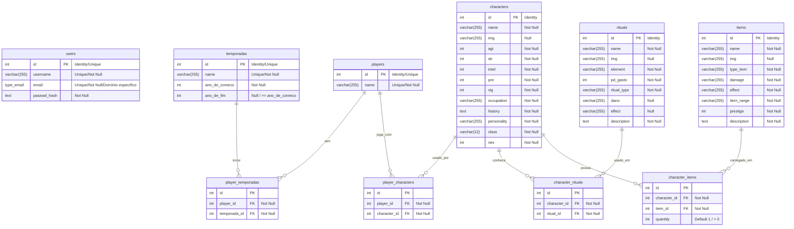
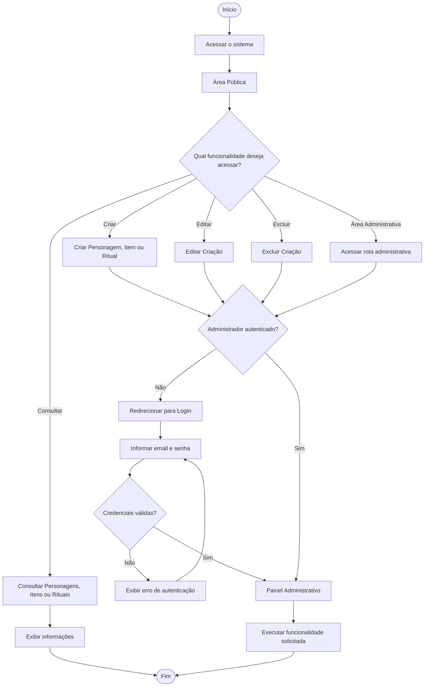

<h1 align="center">Ordo Calamitatis</h1>
<h2 align="center">Sistema de Gerenciamento de Personagens</h2>
<div align="center">


 
 
 
 

</div>
<hr>
Desenvolvida em PHP com banco de dados PostgreSQL, a Ordo Calamitatis é uma aplicação web voltada ao gerenciamento de personagens, itens e rituais — tanto oficiais quanto fan-mades — do RPG **Ordem Paranormal**. 

O sistema visa otimizar a pesquisa sobre essas temáticas e estruturar as criações da comunidade. Para isso, a plataforma implementa operações essenciais de CRUD (Cadastro, Consulta, Atualização e Exclusão), garantindo uma integração robusta e persistente dos dados.

---

## 1. Índice

- [1. Índice](#1-índice)
- [2. Como Executar o Projeto Localmente](#2-como-executar-o-projeto-localmente)
  - [2.1. Pré-Requisitos](#21-pré-requisitos)
  - [2.2. Instalação](#22-instalação)
    - [Passo 1: Clonar o Repositório](#passo-1-clonar-o-repositório)
    - [Passo 2: Configurar o Banco de Dados](#passo-2-configurar-o-banco-de-dados)
    - [Passo 3: Configurar a Conexão no PHP](#passo-3-configurar-a-conexão-no-php)
    - [Passo 4: Acessar a Aplicação localmente](#passo-4-acessar-a-aplicação-localmente)
- [3. Estrutura de Diretórios (INCOMPLETO)](#3-estrutura-de-diretórios-incompleto)
- [4. Especificação de Requisitos](#4-especificação-de-requisitos)
  - [4.1. Requisitos Funcionais](#41-requisitos-funcionais)
  - [4.2. Requisitos Não-Funcionais](#42-requisitos-não-funcionais)
  - [4.3. Regras de Negócio](#43-regras-de-negócio)
- [5. Estrutura do Banco de Dados](#5-estrutura-do-banco-de-dados)
  - [Entidade: `userTabela`](#entidade-usertabela)
  - [Entidade: `temporadas`](#entidade-temporadas)
  - [Entidade: `players`](#entidade-players)
  - [Entidade: `characters`](#entidade-characters)
  - [Entidade: `items`](#entidade-items)
  - [Entidade: `rituals`](#entidade-rituals)
  - [Entidade: `player_temporadas`](#entidade-player_temporadas)
  - [Entidade: `player_characters`](#entidade-player_characters)
  - [Entidade: `character_rituals`](#entidade-character_rituals)
  - [Entidade: `character_items`](#entidade-character_items)
- [6. Diagramas](#6-diagramas)
  - [6.1. Diagrama Entidade-Relacionamento (MER)](#61-diagrama-entidade-relacionamento-mer)
  - [6.2. Fluxo de \[Processo\]](#62-fluxo-de-processo)
- [7. Protótipos](#7-protótipos)
  - [Baixa Fidelidade:](#baixa-fidelidade)
  - [Alta Fidelidade:](#alta-fidelidade)
- [8. Contribuindo](#8-contribuindo)
- [9. Contato \& Suporte](#9-contato--suporte)

---

## 2. Como Executar o Projeto Localmente
Para rodar este projeto na sua máquina, será necessário ter instalado um ambiente de servidor local (PHP) e o banco de dados PostgreSQL.
### 2.1. Pré-Requisitos
- PHP (v7.4 ou superior) habilitado com a extensão pdo_pgsql.
- PostgreSQL instalado e a rodar na porta 5432.
- Git instalado na máquina.
---

### 2.2. Instalação

#### Passo 1: Clonar o Repositório
Abra o *Git Bash*, e escreva o seguinte: 
```bash
# Copie o reposítório externo no GitHub
git clone https://github.com/Eduardo-Nicolete37/OrdoCalamitatis.git

# Abra o arquivo clonado
cd OrdoCalamitatis
```
---

#### Passo 2: Configurar o Banco de Dados
O projeto deve contar com um arquivo SQL dentro da pasta database, nela está toda as estrutura do Banco de Dados ultilizada pelo Backend. 

Siga os passos descritos abaixo para para recriar o banco no seu PostgreSQL:

1. Abra o Terminal ou o Powershell
2. Conecte-se ao Postgres usando o usuário padrão (postgres)

```bash
psql -U postgres
```
3. Se já existir o banco de dados de algum teste anterior, delete-o e recrie a database, usando os comandos abaixo:
```sql
DROP DATABASE IF EXISTS calamitatisdb; 
CREATE DATABASE calamitatisdb;
```
4. Crie um usuário do Postgres específico para gerenciar este Banco de Dados, ainda com o Postgres aberto, escreva os comandos:
```sql
CREATE USER ordo WITH PASSWORD "*sua_senha*";
ALTER DATABASE calamitatisdb OWNER TO ordo;
\q
```

5. Após transferirmos o Banco de Dados para o usuário *ordo*, abriremos a pasta *database*, e faça o seguinte comando para restaurar as tabelas e registros:
```bash
# Caso você não tenha aberto a pasta, faça:
cd database
# Usamos o arquivo já existente para recuperar as estruturas
psql -U ordo -h localhost -d calamitatisdb -f dumpCalamitatisDB.sql
# Retornamos para a raiz
cd ..
```
---
#### Passo 3: Configurar a Conexão no PHP
Pelo VSCode, abra o arquivo *connect.php* na pasta *database*, editando apenas um campo:
```php
$host = "localhost"; # Não altere esse campo
$dbname = "calamitatisdb"; # Não altere esse campo
$user = "ordo"; # Não altere esse campo
$password = "INSIRA SUA SENHA AQUI"; # Altere apenas esse campo
```
---

#### Passo 4: Acessar a Aplicação localmente
Depois de seguir todos esse passos, você abrirá o terminal e fará os seguintes comandos:
```bash
# No caso de a raiz do projeto não estar aberta, use o comando:
cd OrdoCalamitatis
# Caso você deseje rodar a aplicação localmente, execute o comando:
php -S localhost:8000 
```
Por fim, abra no seu navegador de preferencia, digite o URL *localhost:8000*, e aproveite a aplicação.

---

## 3. Estrutura de Diretórios (INCOMPLETO)
<!--TODO: Comentar os arquivos
✅⬜
-->
```
OrdoCalamitatis
│   .gitignore
│   index.php
│   README.md
│
├───app
│   ├───adm
│   │       creations.php
│   │       new_char.php
│   │       new_item.php
│   │       new_ritual.php
│   │
│   └───user
│           assests.php
│           charlist.php
│           history.php
│           rituals.php
│           weapons.php
│
├───database
│       connect.php
│
├───documentation
│       BaixaFidelidade.excalidraw
│       BCD_modelation.md
│       comandosFeitosParaCriacaoDosBancos.pgsql
│       dumpCalamitatisDB.sql
│
├───includes
│       footer.php
│       header.php
│       helpers.php
│
├───login
│       cadastrar.php
│       login.php
│       logout.php
│       verifica_user.php
│
├───pdfs
│       ArquivosSecretos01.pdf
│       ArquivosSecretos02.pdf
│       ArquivosSecretos03.pdf
│       ArquivosSecretos04.pdf
│       ArquivosSecretos05.pdf
│       ArquivosSecretos06.pdf
│       ArquivosSecretos07.pdf
│       FichaDosAgentesEditavel.pdf
│       ordem-paranormal-regras-book.pdf
│       OrdemParanormal2Playtest.pdf
│
├───style
│       style.css
│
└───uploads
```

---


## 4. Especificação de Requisitos

### 4.1. Requisitos Funcionais

| ID | Título | Descrição | Prioridade | Feito? |
|----|--------|-----------|------------|---------|
| **RF01** | Autenticação de Usuários | O sistema deve validar credenciais (email/senha) e criar sessão autenticada | Alta |✅|
| **RF02** | Cadastro de Usuários | O sistema deve permitir novo registro com validação de email único | Alta | ✅ |
| **RF03** | Proteção de Rotas | Páginas de usuário devem redirecionar para login se não autenticado | Alta | ✅ |
| **RF04** | Logout Seguro | Destruir sessão e limpar dados de autenticação | Alta | ✅ |
| **RF05** | Criar Criações | O sistema deve fornecer formulários separados para Personagem, Item e Ritual | Alta | ⬜ |
| **RF06** | Listar Criações | O sistema deve exibir todas as criações do usuário | Alta | ⬜ |
| **RF07** | Editar Criações | O sistema deve permitir atualização de qualquer criação do próprio e somente do usuário | Alta | ⬜ |
| **RF08** | Remover Criações | O sistema deve remover criações com confirmação de segurança | Alta | ⬜ |
| **RF09** | Ver Detalhes | O sistema deve exibir informações completas de cada criação | Média | ⬜ |
| **RF10** | Associar Item a Personagem | O sistema deve permitir que personagens possuam itens | Média | ⬜ |
| **RF11** | Associar Ritual a Personagem | O sistema deve permitir que personagens dominem rituais | Média | ⬜ |
| **RF12** | Associar Criação a Temporada | O sistema deve ligar criações a temporadas específicas | Média | ⬜ |
| **RF13** | Disponibilizar Livros de Referência | O sistema deve disponibilizar, em uma página separada, os livros do Mestre e do Player anexados ao projeto para consulta dos usuários. | Baixa | ✅ |


### 4.2. Requisitos Não-Funcionais


| ID | Título | Descrição | Prioridade | Feito? |
|----|--------|-----------|------------|--------|
| **RNF01** | Linguagem | Back-end desenvolvido em PHP 7.4+ | Alta | ✅ |
| **RNF02** | Banco de Dados | PostgreSQL 12+ | Alta | ✅ |
| **RNF03** | Padrão CRUD | Separação clara de camadas (conexão, lógica, apresentação) | Alta | ✅ |
| **RNF04** | Proteção SQL Injection | Todos os queries devem usar prepared statements | Alta | ✅ |
| **RNF05** | Criptografia de Senha | Usar password_hash() com PASSWORD_DEFAULT | Alta | ✅ |
| **RNF06** | Sessões Seguras | Usar $_SESSION com controle de acesso por user_id | Alta | ✅ |
| **RNF07** | Upload de Imagem | Restringir a JPG/PNG, máx 2MB, renomear com hash | Média | ⬜ |
| **RNF08** | Design Consistente | Variáveis CSS e tema escuro (#1A1A1E) | Média | ✅ |

### 4.3. Regras de Negócio

| ID | Regra | Descrição |
|----|-------|-----------|
| **RN01** | Propriedade Exclusiva | Usuário só pode editar/deletar suas próprias criações |
| **RN02** | Email Único | Não permitir cadastro com email duplicado (constraint UNIQUE) |
| **RN03** | Autenticação Obrigatória | Páginas de criações só acessíveis com sessão ativa |
| **RN04** | Campos Obrigatórios | Nome é obrigatório para todas as criações |
| **RN05** | Validação Email | Deve estar em formato válido (regex) |
| **RN06** | Sem Duplicação M:M | Um personagem não pode ter o mesmo item 2x |

---

## 5. Estrutura do Banco de Dados

### Entidade: `userTabela`

Conta de login do sistema. Não se confunde com `players`, que representa o jogador "de mesa" dono do personagem.

| Campo | Tipo | Restrições | Descrição |
|-------|------|-----------|-----------|
| `id` | INTEGER | PRIMARY KEY GENERATED ALWAYS AS IDENTITY | Identificador único do usuário |
| `username` | VARCHAR(255) | UNIQUE NOT NULL | Nome de usuário único para identificação na plataforma |
| `email` | *typeEmail | UNIQUE NOT NULL REGEX | Email único de autenticação com validação de formato através de regex |
| `passwd` | TEXT | NOT NULL | Senha criptografada usando `password_hash()` do PHP com algoritmo PASSWORD_DEFAULT, nunca armazenada em texto plano |

* *typeEmail* é um domínio personalizado que força o input a ter a estrutura de um email, tem o tamanho de um TEXT, criado com o comando:
```sql
CREATE DOMAIN typeEmail AS TEXT
CHECK (VALUE ~* '^[A-Za-z0-9._%+-]+@[A-Za-z0-9.-]+\.[A-Za-z]{2,}$');
```

### Entidade: `temporadas`

| Campo | Tipo | Restrições | Descrição |
|-------|------|-----------|-----------|
| `id` | INTEGER | PRIMARY KEY GENERATED ALWAYS AS IDENTITY | Identificador único da temporada |
| `name` | VARCHAR(255) | UNIQUE NOT NULL | Nome único da temporada |
| `ano_de_comeco` | INTEGER | NOT NULL | Ano em que a temporada começou |
| `ano_de_fim` | INTEGER | CHECK (ano_de_fim IS NULL OR ano_de_fim >= ano_de_comeco) | Ano de término da temporada. `NULL` indica que ainda está em andamento |

### Entidade: `players`

Jogador "de mesa", ou seja, a pessoa real que é dona de um ou mais personagens. Não tem ligação com `userTabela`.

| Campo | Tipo | Restrições | Descrição |
|-------|------|-----------|-----------|
| `id` | INTEGER | PRIMARY KEY GENERATED ALWAYS AS IDENTITY | Identificador único do jogador |
| `name` | VARCHAR(255) | UNIQUE NOT NULL | Nome único do jogador |

### Entidade: `characters`

| Campo | Tipo | Restrições | Descrição |
|-------|------|-----------|-----------|
| `id` | INTEGER | PRIMARY KEY GENERATED ALWAYS AS IDENTITY | Identificador único do personagem |
| `name` | VARCHAR(255) | NOT NULL | Nome do personagem (pode repetir entre personagens) |
| `img` | VARCHAR(255) | | Caminho relativo da imagem do personagem (ex.: `uploads/img_123.jpg`) |
| `agi` | INTEGER | NOT NULL CHECK (agi >= 0) | Atributo Agilidade |
| `str` | INTEGER | NOT NULL CHECK (str >= 0) | Atributo Força |
| `intel` | INTEGER | NOT NULL CHECK (intel >= 0) | Atributo Intelecto (renomeado de `int` para não conflitar com o tipo SQL) |
| `pre` | INTEGER | NOT NULL CHECK (pre >= 0) | Atributo Presença |
| `vig` | INTEGER | NOT NULL CHECK (vig >= 0) | Atributo Vigor |
| `occupation` | VARCHAR(255) | NOT NULL | Origem (passado) do personagem, escolhida na lista ou digitada |
| `history` | TEXT | NOT NULL | História de fundo do personagem (TEXT porque costuma passar de 255 caracteres) |
| `personality` | VARCHAR(255) | NOT NULL | Traços de personalidade do personagem, separados por vírgula (ex.: `Cético, Protetor`) |
| `class` | VARCHAR(12) | NOT NULL CHECK (class IN ('Combatente', 'Especialista', 'Ocultista')) | Classe do personagem |
| `nex` | INTEGER | NOT NULL CHECK (nex BETWEEN 0 AND 99) | Nível de exposição (NEX) do personagem |

### Entidade: `items`

| Campo | Tipo | Restrições | Descrição |
|-------|------|-----------|-----------|
| `id` | INTEGER | PRIMARY KEY GENERATED ALWAYS AS IDENTITY | Identificador único do item |
| `name` | VARCHAR(255) | NOT NULL | Nome do item |
| `img` | VARCHAR(255) | | Caminho relativo da imagem do item |
| `type_item` | VARCHAR(255) | NOT NULL | Tipo do item (ex.: Arma, Proteção, Geral, Paranormal) |
| `damage` | VARCHAR(255) | | Dano causado pelo item, em texto livre (ex.: "1d6"). `NULL` se não for arma |
| `effect` | VARCHAR(255) | | Efeito resumido do item. `NULL` se não houver |
| `item_range` | VARCHAR(255) | | Alcance do item (renomeado de `range` para evitar conflito com palavra do SQL). `NULL` se não for arma |
| `prestige` | INTEGER | NOT NULL DEFAULT 0 | Valor de prestígio do item |
| `description` | TEXT | NOT NULL | Descrição completa do item |
| `category` | VARCHAR(3) | | Categoria do item (0, I, II, III ou IV) |
| `space` | INTEGER | NOT NULL DEFAULT 1 CHECK (space >= 0) | Espaços que o item ocupa no inventário |
| `critical` | VARCHAR(10) | | Margem de ameaça e multiplicador do crítico (ex.: `19/x2`) |
| `damage_type` | VARCHAR(20) | | Tipo de dano (ex.: Corte, Impacto, Perfuração, Balístico) |

### Entidade: `rituals`

| Campo | Tipo | Restrições | Descrição |
|-------|------|-----------|-----------|
| `id` | INTEGER | PRIMARY KEY GENERATED ALWAYS AS IDENTITY | Identificador único do ritual |
| `name` | VARCHAR(255) | NOT NULL | Nome do ritual |
| `img` | VARCHAR(255) | | Caminho relativo da imagem do ritual |
| `element` | VARCHAR(255) | NOT NULL | Elemento ao qual o ritual pertence |
| `pd_gasto` | INTEGER | NOT NULL | Custo em PD para conjurar o ritual |
| `ritual_type` | VARCHAR(255) | NOT NULL | Tipo do ritual, como o círculo (renomeado de `type` para evitar confusão com palavra do SQL) |
| `dano` | VARCHAR(255) | | Dano causado pelo ritual, em texto livre. `NULL` se não causar dano |
| `effect` | VARCHAR(255) | | Efeito resumido do ritual. `NULL` se não houver |
| `description` | TEXT | NOT NULL | Descrição completa do ritual |

### Entidade: `player_temporadas`

Tabela de conexão (N:N) entre jogadores e temporadas.

| Campo | Tipo | Restrições | Descrição |
|-------|------|-----------|-----------|
| `id` | INTEGER | PRIMARY KEY GENERATED ALWAYS AS IDENTITY | Identificador único do vínculo |
| `player_id` | INTEGER | NOT NULL FK → `players(id)` ON DELETE CASCADE | Jogador que participa da temporada |
| `temporada_id` | INTEGER | NOT NULL FK → `temporadas(id)` ON DELETE CASCADE | Temporada da qual o jogador participa |

* `UNIQUE (player_id, temporada_id)` impede registrar o mesmo jogador duas vezes na mesma temporada.
* Índice em `temporada_id` para acelerar consultas por temporada.

### Entidade: `player_characters`

Tabela de conexão (N:N) entre jogadores e personagens.

| Campo | Tipo | Restrições | Descrição |
|-------|------|-----------|-----------|
| `id` | INTEGER | PRIMARY KEY GENERATED ALWAYS AS IDENTITY | Identificador único do vínculo |
| `player_id` | INTEGER | NOT NULL FK → `players(id)` ON DELETE CASCADE | Jogador que usa o personagem |
| `character_id` | INTEGER | NOT NULL FK → `characters(id)` ON DELETE CASCADE | Personagem usado pelo jogador |

* `UNIQUE (player_id, character_id)` impede vínculos duplicados.
* Índice em `character_id` para acelerar consultas por personagem.

### Entidade: `character_rituals`

Tabela de conexão (N:N) entre personagens e rituais.

| Campo | Tipo | Restrições | Descrição |
|-------|------|-----------|-----------|
| `id` | INTEGER | PRIMARY KEY GENERATED ALWAYS AS IDENTITY | Identificador único do vínculo |
| `character_id` | INTEGER | NOT NULL FK → `characters(id)` ON DELETE CASCADE | Personagem que conhece o ritual |
| `ritual_id` | INTEGER | NOT NULL FK → `rituals(id)` ON DELETE CASCADE | Ritual conhecido pelo personagem |

* `UNIQUE (character_id, ritual_id)` impede o mesmo ritual duplicado no mesmo personagem.
* Índice em `ritual_id` para acelerar consultas por ritual.

### Entidade: `character_items`

Tabela de conexão (N:N) entre personagens e itens, com quantidade.

| Campo | Tipo | Restrições | Descrição |
|-------|------|-----------|-----------|
| `id` | INTEGER | PRIMARY KEY GENERATED ALWAYS AS IDENTITY | Identificador único do vínculo |
| `character_id` | INTEGER | NOT NULL FK → `characters(id)` ON DELETE CASCADE | Personagem que possui o item |
| `item_id` | INTEGER | NOT NULL FK → `items(id)` ON DELETE CASCADE | Item possuído pelo personagem |
| `quantity` | INTEGER | NOT NULL DEFAULT 1 CHECK (quantity > 0) | Quantidade de unidades do item que o personagem possui |

* `UNIQUE (character_id, item_id)` garante uma única linha por par. Para ter mais unidades, aumente `quantity`.
* Índice em `item_id` para acelerar consultas por item.

### Entidade: `character_skills`

Tabela de conexão entre personagens e as perícias em que eles são treinados. Cada linha é uma perícia treinada.

| Campo | Tipo | Restrições | Descrição |
|-------|------|-----------|-----------|
| `id` | INTEGER | PRIMARY KEY GENERATED ALWAYS AS IDENTITY | Identificador único do vínculo |
| `character_id` | INTEGER | NOT NULL FK → `characters(id)` ON DELETE CASCADE | Personagem treinado na perícia |
| `skill` | VARCHAR(30) | NOT NULL | Nome da perícia (ex.: Atletismo, Investigação), validado pela lista do formulário |

* `UNIQUE (character_id, skill)` impede a mesma perícia duplicada no mesmo personagem.
* Não precisa de índice extra em `character_id`, porque o índice do `UNIQUE` já começa por essa coluna.
---

## 6. Diagramas

### 6.1. Diagrama Entidade-Relacionamento (MER)


### 6.2. Fluxo de [Processo]



---

## 7. Protótipos

### Baixa Fidelidade: 

  - [Veja aqui - ExcaliDraw](https://excalidraw.com/#json=mOz5fB1gU0QkTu2AIVhdC,fJeDVOdbInvNZ659q8qCpA)

---

### Alta Fidelidade:
 - [Veja aqui - Figma](https://www.figma.com/design/UTbWf2dmiM2E0KfQ6hpcI6/Prot%C3%B3tipo---Ordo-Calamitatis?node-id=0-1&t=HHRskXJG7ZlVPTdt-1)

---

## 8. Contribuindo

1. Faça um Fork do projeto
2. Crie uma branch para sua feature (`git checkout -b feature/MinhaFeature`)
3. Commit suas mudanças (`git commit -m 'Adiciona MinhaFeature'`)
4. Push para a branch (`git push origin feature/MinhaFeature`)
5. Abra um Pull Request

---

## 9. Contato & Suporte

- **Autor**: Eduardo Nicolete
- **Email**: eduardonicolete79@gmail.com
- **GitHub**: github.com/Eduardo-Nicolete37

<!--
$id = isset($_GET['id']) ? intval($_GET['id']) : 0;
Para retirar o ID do personagem da URL
-->