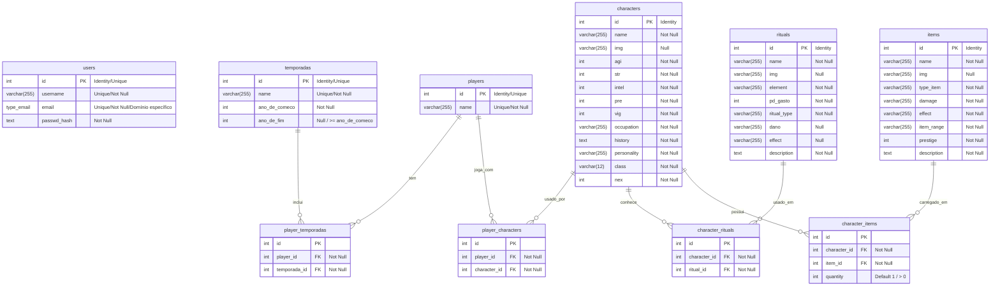

## BCD user

```mermaid
erDiagram

users {
        int id PK "Identity/Unique"
        varchar(255) username "Unique/Not Null"
        type_email email "Unique/Not Null/Domínio específico"
        text passwd_hash "Not Null"
    }
temporadas {
    int id PK "Identity/Unique"
    varchar(255) name "Unique/Not Null"
    int ano_de_comeco "Not Null"
    int ano_de_fim "Null / >= ano_de_comeco"
    }

players {
    int id PK "Identity/Unique"
    varchar(255) name "Unique/Not Null"
    }

characters {
    int id PK "Identity"
    varchar(255) name "Not Null"
    varchar(255) img "Null"
    int agi "Not Null"
    int str "Not Null"
    int intel "Not Null"
    int pre "Not Null"
    int vig "Not Null"
    varchar(255) occupation "Not Null"
    text history "Not Null"
    varchar(255) personality "Not Null"
    varchar(12) class "Not Null"
    int nex "Not Null"
    }

items {
    int id PK "Identity"
    varchar(255) name "Not Null"
    varchar(255) img "Null"
    varchar(255) type_item "Not Null"
    varchar(255) damage "Not Null"
    varchar(255) effect "Not Null"
    varchar(255) item_range "Not Null"
    int prestige "Not Null"
    text description "Not Null"
    }

rituals {
    int id PK "Identity"
    varchar(255) name "Not Null"
    varchar(255) img "Null"
    varchar(255) element "Not Null"
    int pd_gasto "Not Null"
    varchar(255) ritual_type "Not Null"
    varchar(255) dano "Null"
    varchar(255) effect "Null"
    text description "Not Null"
    }

player_temporadas {
    int id PK
    int player_id FK "Not Null"
    int temporada_id FK "Not Null"
    }

player_characters {
    int id PK
    int player_id FK "Not Null"
    int character_id FK "Not Null"
    }

character_rituals {
    int id PK
    int character_id FK "Not Null"
    int ritual_id FK "Not Null"
    }

character_items {
    int id PK
    int character_id FK "Not Null"
    int item_id FK "Not Null"
    int quantity "Default 1 / > 0"
    }

players ||--o{ player_temporadas : "tem"
temporadas ||--o{ player_temporadas : "inclui"

players ||--o{ player_characters : "joga_com"
characters ||--o{ player_characters : "usado_por"

characters ||--o{ character_rituals : "conhece"
rituals ||--o{ character_rituals : "usado_em"

characters ||--o{ character_items : "possui"
items ||--o{ character_items : "carregado_em"
```