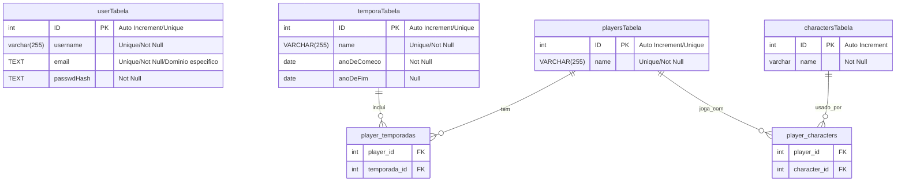

## BCD user

```mermaid
erDiagram

userTabela {
    int ID PK "Auto Increment/Unique"
    varchar(255) username "Unique/Not Null"
    TEXT email "Unique/Not Null/Dominio especifico"
    TEXT passwdHash "Not Null"
}

temporaTabela {
    int ID PK "Auto Increment/Unique"
    VARCHAR(255) name "Unique/Not Null"
    date anoDeComeco "Not Null"
    date anoDeFim "Null"
}
playersTabela {
    int ID PK "Auto Increment/Unique"
    VARCHAR(255) name "Unique/Not Null"
}
charactersTabela {
    int ID PK "Auto Increment"
    varchar name "Not Null"
}
player_temporadas {
    int player_id FK
    int temporada_id FK
}

player_characters {
    int player_id FK
    int character_id FK
}

playersTabela ||--o{ player_temporadas : "tem"
temporaTabela ||--o{ player_temporadas : "inclui"
    
playersTabela ||--o{ player_characters : "joga_com"
charactersTabela ||--o{ player_characters : "usado_por"
```